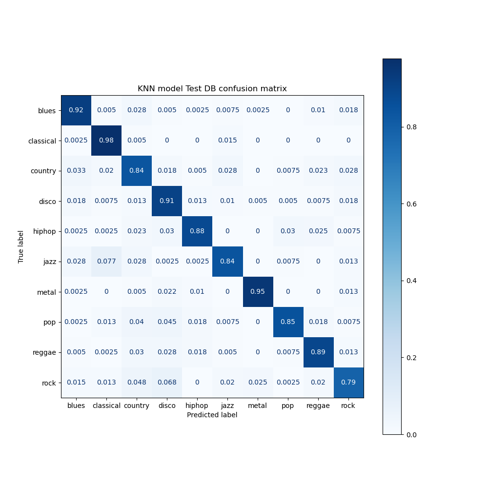
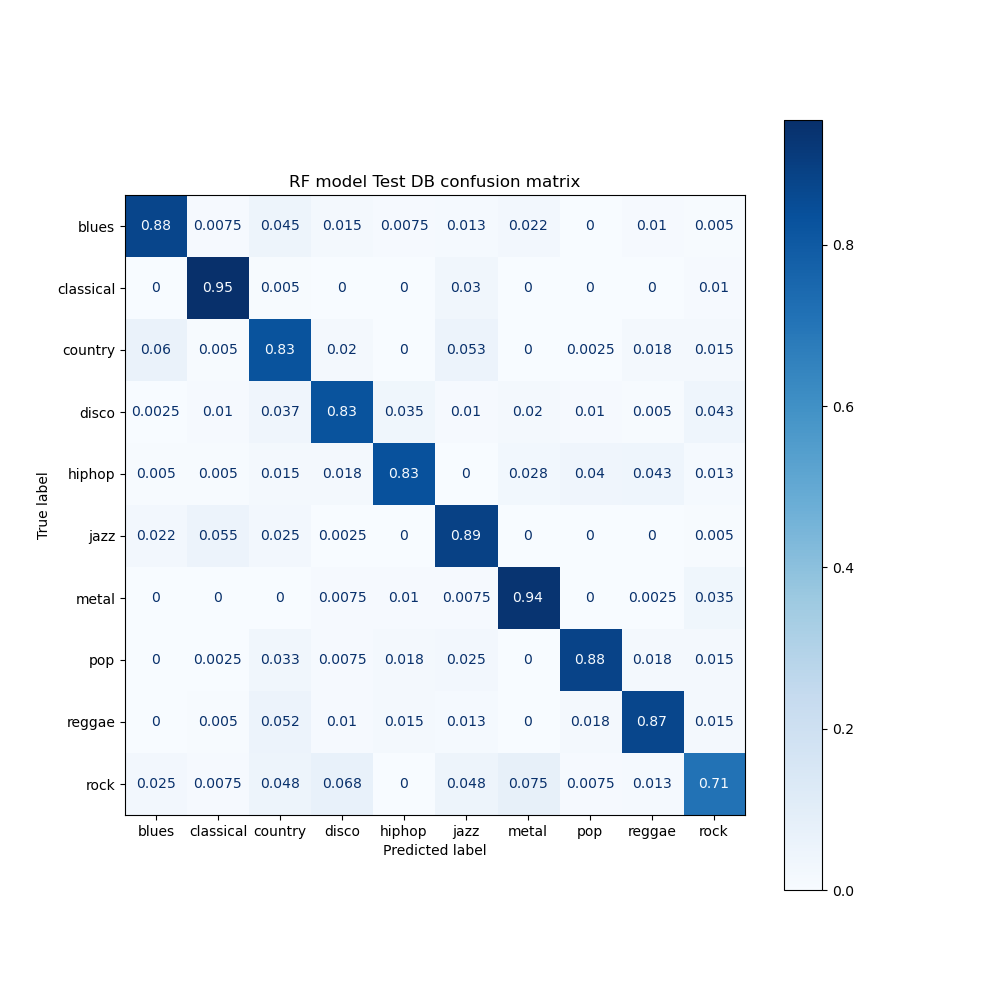
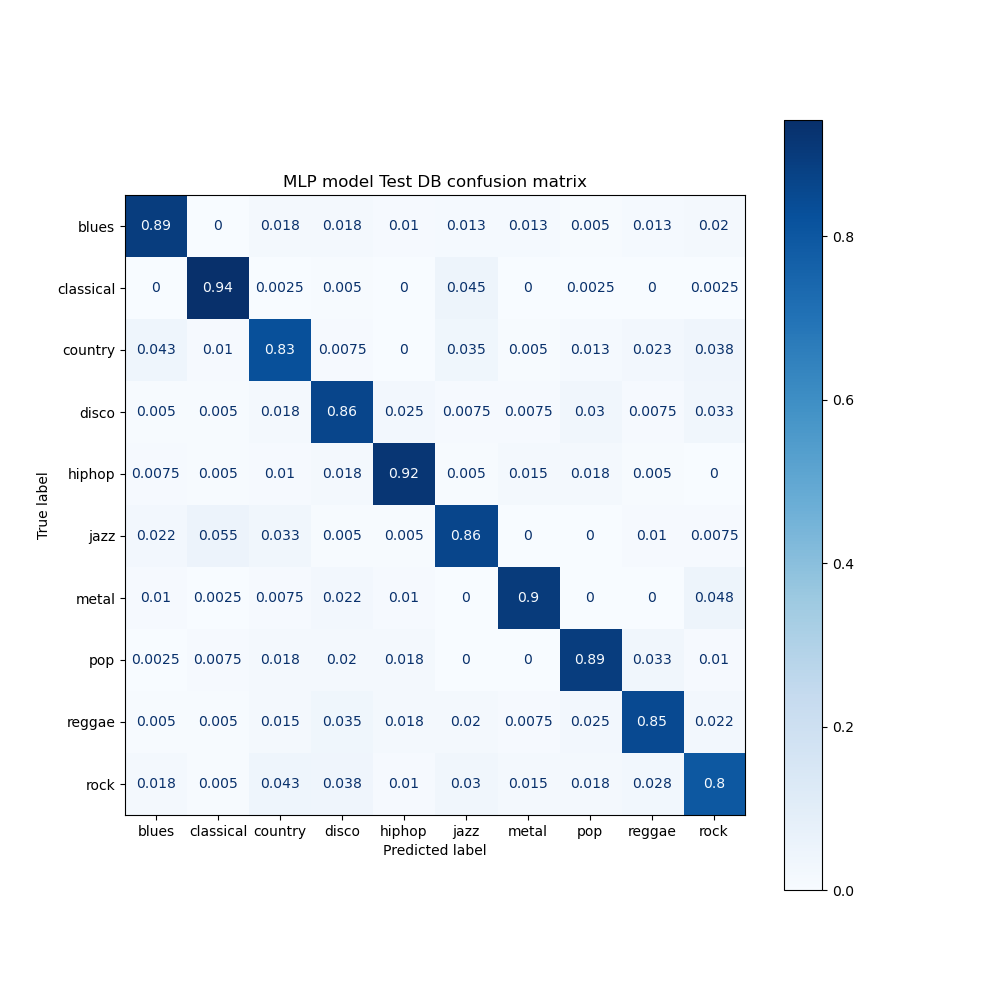
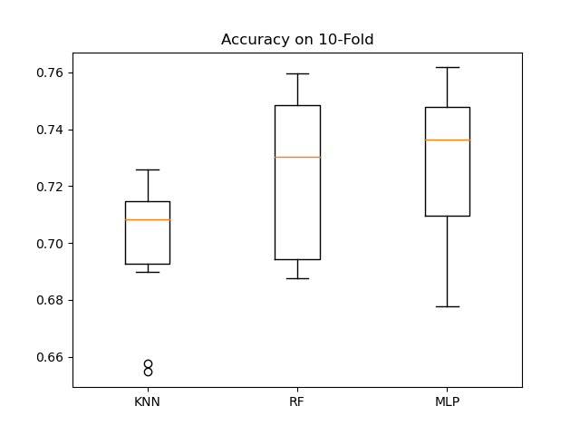
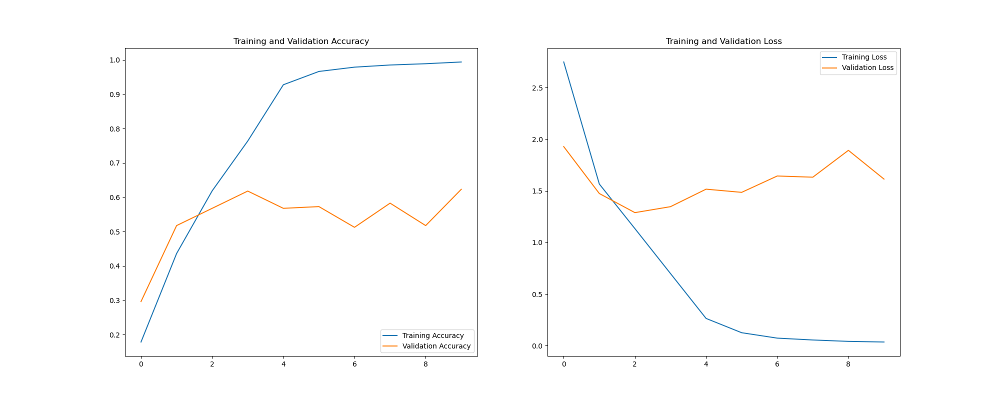
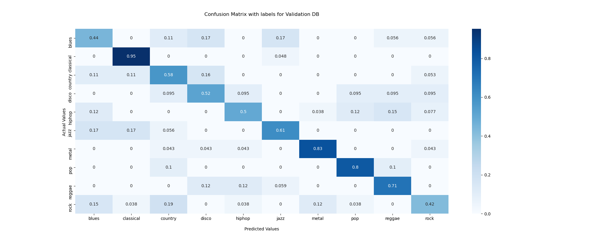
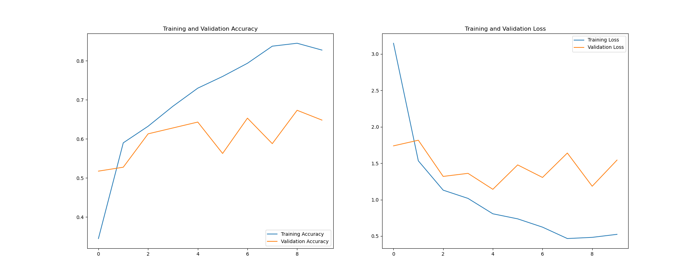
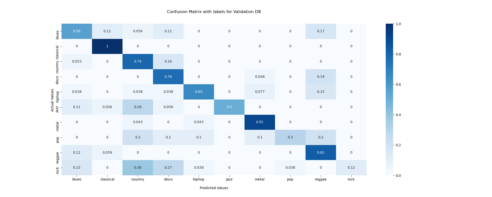

# Music genre classification
 
This work aims to explore the music genre classification.

We first analyze the GTZAN database, a famous database, and build a model that is capable of classify a wav file into a category of 10 music genres :
- blues
- classical
- disco
- hiphop
- jazz
- metal
- pop
- reggae
- rock

## Download the data

Data can be downloaded here : 
https://www.kaggle.com/andradaolteanu/gtzan-dataset-music-genre-classification

It contains :
- 30 seconds sound extract (100 per genres)
- A csv file containing 58 computed features on the 30 seconds file
- A csv file containing 58 computed features on 10 chunks of 3s from the 30 seconds file
- An image 432x288 representing the Mel Spectrogram for each 30s wav file

## Data exploration

The data exploration and preparation can be found on the jupyter notebook GTZAN_Dataset.ipynb

## Building a model

A few machine learning and deep learning models are built and compared. 

train_ml_models : train ML models and a MLP model 
train_dl_models : train deep learning models 

 

### K nearest neighbors, Random Forest and Multi Layer Perceptron

We split the train / test database and ense that a sample from the same song is not in the train and test database. 
30 songs (3 of each genre) are selected for the test dataset. The rest is shuffled and reserved for the train dataset.

We observe that most of the models perform very well for classical and metal genre. This can be understood as those two genre easily stand out in a rythm, melody, and instrument point of view.

- knn accuracy = 0.719
- rf accuracy = 0.745
- mlp accuracy = 0.799

 

### Deep learning : CNN
A traditional CNN model trained on our image dataset quickly overfit on the training database and never reaches a good accuracy on the validation database. 

 

We don't have enough data to build a powerful CNN. One way of overcoming this flaw, is to do transfer learning with an existing model trained on ImageNet database. We thus use powerful filters learnt on the big ImageNet database. Then, we finetune the model with our own data. 

 

## Conclusion

Best accuracy is obtained with MLP model (0.79). We can see here that classifying music genre is not an easy task. With this GTZAN dataset, we definitely don't have enough datasets (100 songs per genre) to train a performant classifier. 

Furthermore, it has been shown that the GTZAN dataset contains duplicates and mislabelling, that could lead to inflation of accuracy, or overfitting. 
Having the same artist in the train and test DB could create a bias, even though it is two different songs. 
> [..]7.2% of the excerpts come from the same recording (including 5% duplicated exactly); 10.6% of the dataset is mislabeled

https://projet.liris.cnrs.fr/imagine/pub/proceedings/ACM-MULTIMEDIA-2012/mirum/p7.pdf

To improve the models, we need more data. Bigger databsae exist :
- MagnaTagTune (https://paperswithcode.com/dataset/magnatagatune)
- the Million Song Dataset