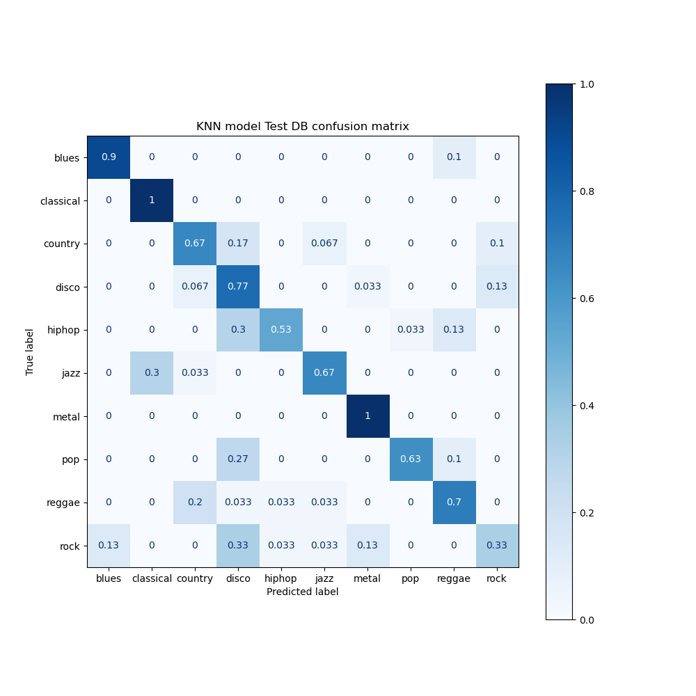
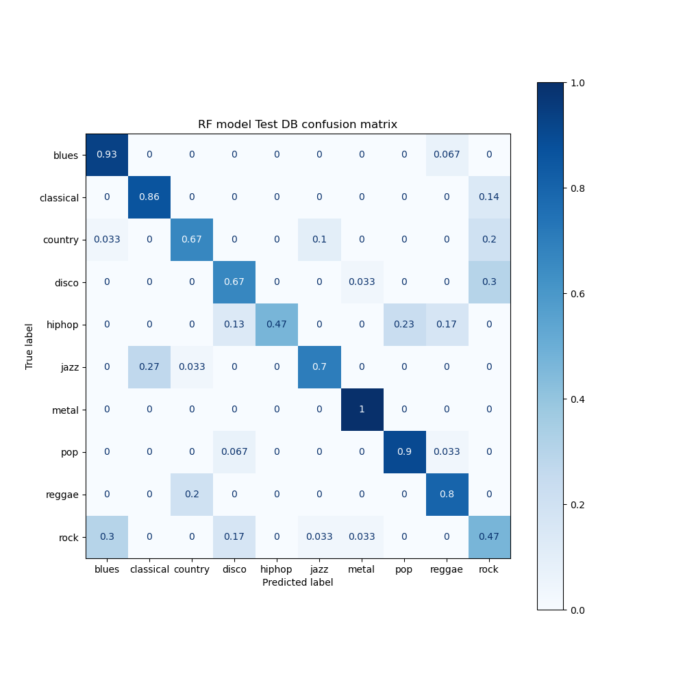

# gtzan_db
 
This work aims to analyze the GTZAN database (https://www.kaggle.com/andradaolteanu/gtzan-dataset-music-genre-classification) and build a model that is capable of classify a wave file into a category of 10 music genres.

A few machine learning and deep learning models are built and compared. 
GTZAN_Dataset.ipynb : database observation and models fine tuning  
train_ml_models : train ML models and MLP model 
train_cnn_models : train deep learning models 

## K nearest neighbors, Random Forest and Multi Layer Perceptron

 

 
 

## Deep learning : CNN

 

